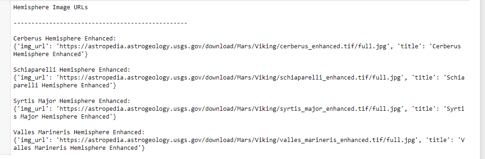
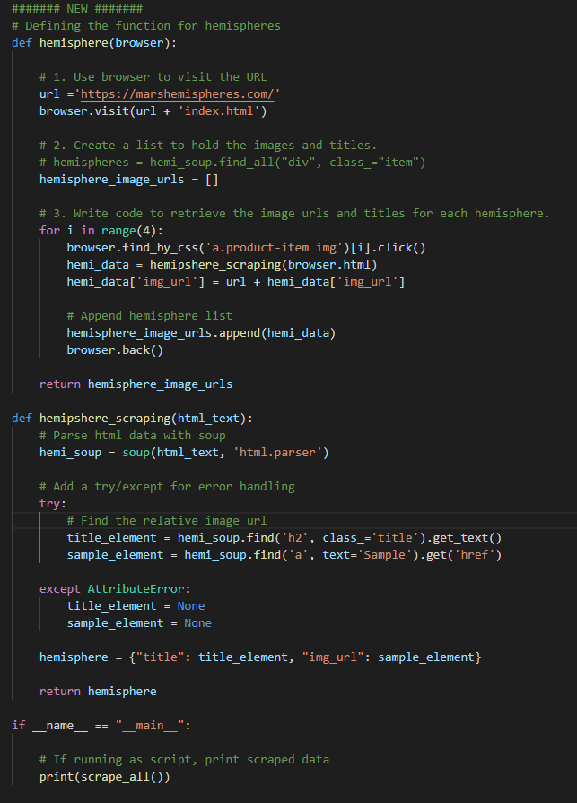
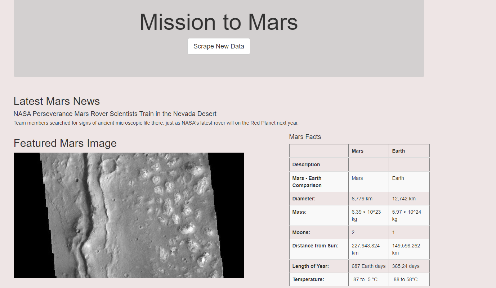

# Mission to Mars Web Scraping Analysis

## **Mission to Mars Web Scraping Analysis**: the purpose of this analysis was to adjust our Module 10 web app to include all four of the Mars hemisphere images. To do this, we used BeautifulSoup and Splinter to scrape full-resolution images of Mars’s hemispheres and the titles of those images, stored the scraped data on our Mongo database, used a web application to display the data, and altered the design of the web app to accommodate these images and make them mobile-friendly. 

## **What we created**: 

1. Scraped Full-Resolution Mars Hemisphere Images and Titles

2. Updated the Web App with Mars Hemisphere Images and Titles

3. Added Bootstrap 3 Components

